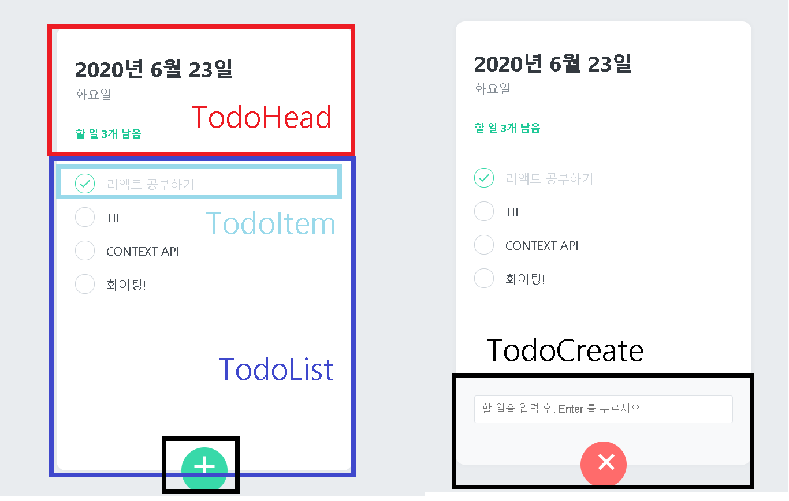
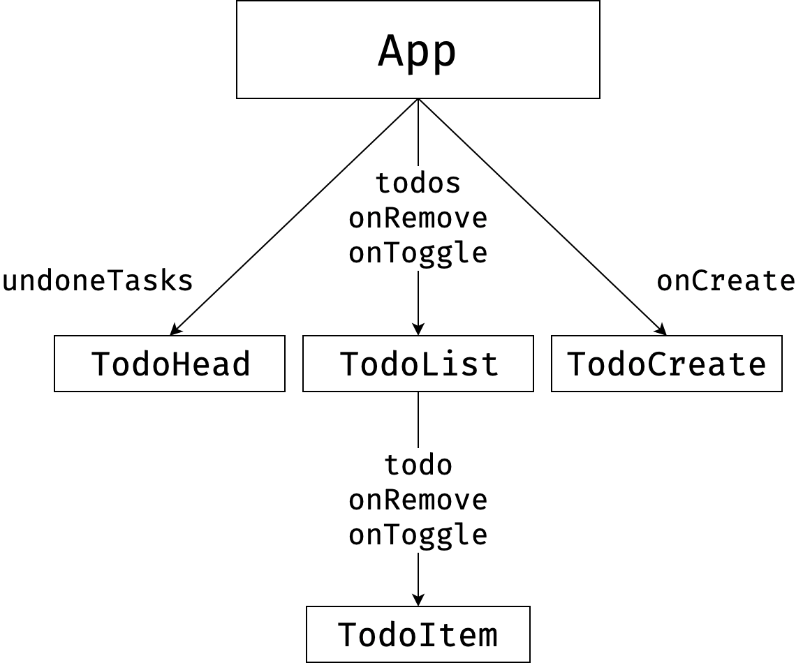
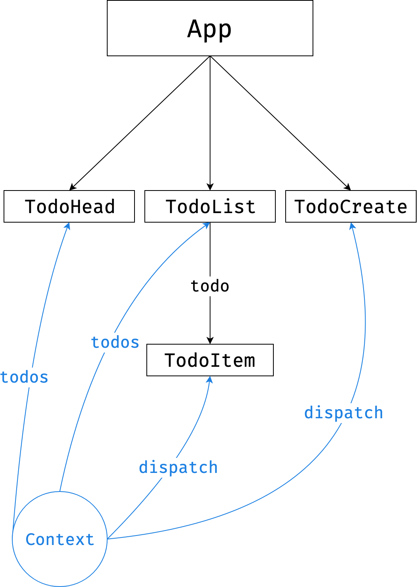

# TodoList 만들기

벨로퍼트와 함께하는 모던 리액트 참고. [링크](https://react.vlpt.us/mashup-todolist/)

TodoList 만드는 과정 중 Context API 관련 내용 정리

# 목차

- [프로젝트의 컴포넌트둘](#프로젝트의-컴포넌트둘)
- [Context API 사용 여부 차이](#Context-API-사용-여부-차이)
- [커스텀 Hook 만들기](#커스텀-Hook-만들기)
- [커스텀 Hook에서 에러처리](#커스텀-Hook에서-에러처리)
- [state와 dispatch 분리해서 context 만들기](#state와-dispatch-분리해서-context-만들기)

# 프로젝트의 컴포넌트둘

- TodoHead : 오늘의 날짜와 요일, 앞으로 해야 할 일 렌더링
- TodoList : 여러개의 TodoItem 컴포넌트를 렌더링
- TodoItem : 각 할 일에 대한 정보를 렌더링, 완료여부 토글, 삭제 기능
- TodoCreate : 새로운 할 일을 등록할 수 있게 해주는 컴포넌트



# Context API 사용 여부 차이



> 출처: https://react.vlpt.us/mashup-todolist/02-manage-state.html

최상위 컴포넌트인 App 에서 모든 상태 관리를 하기엔 App 컴포넌트의 코드가 너무 복잡해질 수도 있고, props 를 전달해줘야 하는 컴포넌트가 너무 깊숙히 있을 수도 있음.



> 출처: https://react.vlpt.us/mashup-todolist/02-manage-state.html

선이 많아서 구조가 복잡해 보일 수도 있지만, 실제로 코드는 굉장히 깔금.

# 커스텀 Hook 만들기

## useContext 를 직접 사용하는 대신에, useContext 를 사용하는 커스텀 Hook 내보내기

```js
import React, { useReducer, createContext, useContext } from "react";

//...

const TodoStateContext = createContext();
const TodoDispatchContext = createContext();

export function TodoProvider({ children }) {
  const [state, dispatch] = useReducer(todoReducer, initialTodos);
  return (
    <TodoStateContext.Provider value={state}>
      <TodoDispatchContext.Provider value={dispatch}>
        {children}
      </TodoDispatchContext.Provider>
    </TodoStateContext.Provider>
  );
}

export function useTodoState() {
  return useContext(TodoStateContext);
}

export function useTodoDispatch() {
  return useContext(TodoDispatchContext);
}
```

나중에 이렇게 사용 가능.

```js
import React from "react";
import { useTodoState, useTodoDispatch } from "../TodoContext";

function Sample() {
  const state = useTodoState();
  const dispatch = useTodoDispatch();
  return <div>Sample</div>;
}
```

# 커스텀 Hook에서 에러처리

## 나중에 실수를 했을 때 문제점을 빨리 발견 할 수 있음.

```js
export function useTodoState() {
  const context = useContext(TodoStateContext);
  if (!context) {
    throw new Error("Cannot find TodoProvider");
  }
  return context;
}

export function useTodoDispatch() {
  const context = useContext(TodoDispatchContext);
  if (!context) {
    throw new Error("Cannot find TodoProvider");
  }
  return context;
}

export function useTodoNextId() {
  const context = useContext(TodoNextIdContext);
  if (!context) {
    throw new Error("Cannot find TodoProvider");
  }
  return context;
}
```

# state와 dispatch 분리해서 context 만들기

## state 변화가 없는 컴포넌트에서 React.memo로 최적화 가능

TodoItem과 TodoCreate는 state context 사용하지 않음.

TodoItem은 todo 정보를 TodoList 컴포넌트에서 받아옴. onToggle과 onRemove를 dispatch를 활용해 사용.

TodoCreate는 dispatch를 사용해서 새로운 todo 생성.

둘다 React.memo로 최적화 가능.

context를 state와 dispatch로 묶어서 만들었으면 불가능 했음.

```js
// ...
import { useTodoDispatch } from "../TodoContext";

// ...
function TodoItem({ id, done, text }) {
  const dispatch = useTodoDispatch();
  const onToggle = () => dispatch({ type: "TOGGLE", id });
  const onRemove = () => dispatch({ type: "REMOVE", id });
  return (
    <TodoItemBlock>
      <CheckCircle done={done} onClick={onToggle}>
        {done && <MdDone />}
      </CheckCircle>
      <Text done={done}>{text}</Text>
      <Remove onClick={onRemove}>
        <MdDelete />
      </Remove>
    </TodoItemBlock>
  );
}

export default TodoItem;
```

```js
// ...
import { useTodoDispatch, useTodoNextId } from '../TodoContext';

// ...

function TodoCreate() {
  const [open, setOpen] = useState(false);
  const [value, setValue] = useState('');

  const dispatch = useTodoDispatch();
  const nextId = useTodoNextId();

  const onToggle = () => setOpen(!open);
  const onChange = e => setValue(e.target.value);
  const onSubmit = e => {
    e.preventDefault(); // 새로고침 방지
    dispatch({
      type: 'CREATE',
      todo: {
        id: nextId.current,
        text: value,
        done: false
      }
    });
    setValue('');
    setOpen(false);
    nextId.current += 1;
  };

  // ...
```
